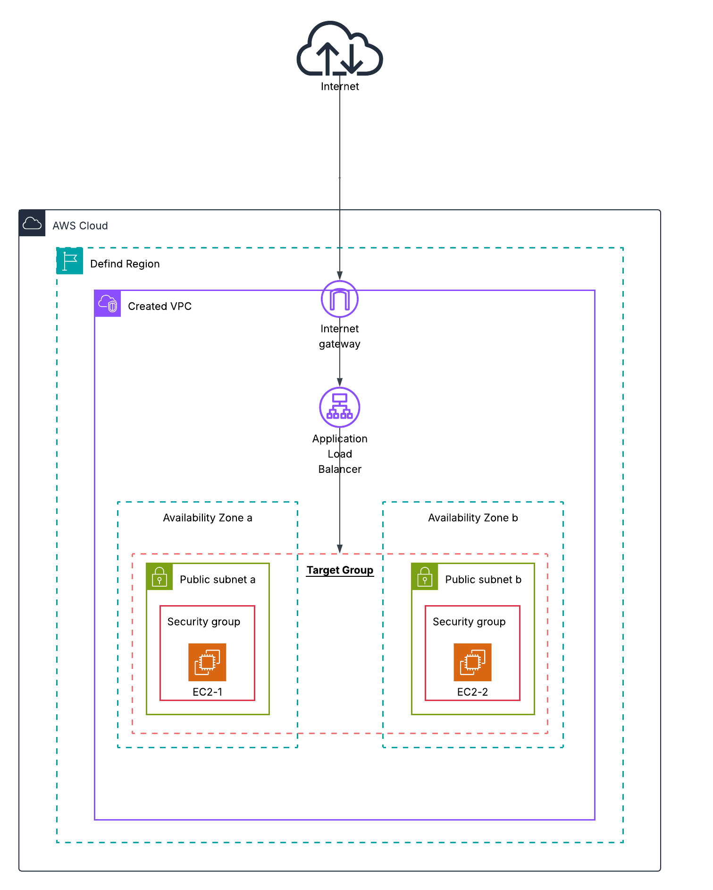

## Variable and Function Filled Terraform - Creating a Simple AWS Web Server behind an ALB

Thank you for stopping by. This Terraform project is designed to be highly flexible and reusable, leveraging a variable-driven approach to control the deployment of a scalable, public-facing web server architecture on AWS, with http traffic managed by a created Application Load Balancer (ALB). The configuration is split into several logical `.tf` files for clarity and maintainability.

By default, running this project will provision a single VPC containing two public subnets. An EC2 instance will be deployed into each subnet, and both instances will be placed behind the ALB. After a successful deployment, the project outputs the DNS name for the load balancer, which you can use to access the web servers in a round-robin fashion (distributing traffic evenly between them).

Below is the proposed architecture:

---
## 📂  Files and Their Structure

### 1. `variables.tf` File 📥

This file contains the defined input `variable` and `locals` blocks that are referenced throughout the configuration. While both can be referenced throughout this module, only **input variables** (using `var.<NAME>`) are meant to receive values from outside the module (e.g., from a `.tfvars` file). Local values (`local.<NAME>`) are for internal use.

### 2. `vpc_igw_subnet.tf` File 🌐

This file has the configuration information for the VPC, Internet Gateway, Availability Zone lookups, and subnet creation. It makes heavy use of variable references to avoid hardcoding values.

- **A Special Mention: The `for_each` Meta-Argument** The `aws_subnet` resource uses the `for_each` meta-argument. This will effectively create multiple iterations of the `aws_subnet` block based on the `var.public_subnets` map. With this implementation, the number of key-value pairs you define in the `public_subnets` variable has a direct correlation to the number of subnets created in AWS.
    
- **A Special Mention: The `cidrsubnet` Function** The `cidr_block` for each subnet is calculated automatically with `cidrsubnet(var.vpc_cidr, 8, each.value)`. This function takes the base VPC CIDR and creates a unique, smaller subnet range for each iteration of the loop.
	- The function takes three arguments: `cidrsubnet(prefix, newbits, netnum)`:
		
		- **`prefix`**: The starting CIDR block, like your VPC's IP range (e.g., `"10.0.0.0/16"`).
		    
		- **`newbits`**: The number of additional bits to add to the prefix. This determines how large the new subnet will be.
		    
		- **`netnum`**: The index number of the subnet you want to create (starting from 0).
    

### 3. `routing.tf` File 🗺️

This file contains the `aws_route_table` and `aws_route_table_association` resources. These define the traffic routing rules for the VPC, ensuring the subnets created in the previous step have a path to the Internet Gateway.

### 4. `sg.tf` & `alb_sg.tf` Files 🛡️

These files contain the resources that define the security groups and their rules.

- The `alb_sg.tf` file creates a security group for the load balancer, allowing public internet traffic on port 80.
    
- The `sg.tf` file creates a security group for the EC2 instances. Its rules allow inbound traffic on port 80 _only from the load balancer's security group_ and on port 22 (SSH) from the IP range you specify in the `var.ingress_ipv4_ssh` variable.
    

### 5. `ec2_ami.tf` File 🖥️

This file contains the `data "aws_ami"` block to find a machine image and the `resource "aws_instance"` blocks to build the EC2 instances.

- A `data` block is used to look up the most recent Amazon Linux 2023 AMI that matches the filter pattern. The wildcard (`*`) in the `values` acts as a substitute for changing parts of the AMI name, like the date.
    
- The `aws_instance` resource then uses `for_each` to create one EC2 instance in each of the created public subnets.
    
- **A Special Mention: The `file()` function** The `user_data` argument uses the expression `file("${path.module}/${var.user_data_script[each.key]}")`. This is a flexible pattern where `path.module` provides a reliable path to the current directory, and the `file()` function reads the content of the script specified in the `var.user_data_script` map.
    

### 6. `alb.tf` File ⚖️

This file has the resources to create the AWS Application Load Balancer (ALB), the load balancer target group, the listener for port 80, and the attachments that register each created EC2 instance with the target group.

### 7. `output.tf` File 📤

This file contains the `output` blocks to display the public DNS name of the ALB after the configuration is successfully applied.

---

## 🚀 How to Use and Verify

This section outlines the steps to deploy the infrastructure and verify that the Application Load Balancer is working correctly.

### 1. Deploy the Infrastructure

The standard Terraform workflow is used to provision the resources. Just run the normal `terraform apply` command (provided you have initiaized your configuration )
### 2. Verify the Deployment

Once the `terraform apply` is complete, Terraform will display the output values.

- **Get the ALB Address:** Find the `alb_dns_name` in the output section and copy the URL.
    
- **Test in Your Browser:** Paste the copied DNS name into your web browser's address bar. You should see the simple webpage created by the startup script.
    
- **Verify Load Balancing:** To confirm that the load balancer is distributing traffic between your instances, **refresh the page several times**. You should see the "Instance Name" or "Private Ip Address" displayed on the page change as the ALB routes your requests to the different EC2 instances in the target group.

If you run the default code with the default scripts, you should have one load balancer DNS that give pages looking like the ones below when you refresh the page.

---

## ⚠️ Limitations

This configuration provides a solid foundation, but it's important to understand its limitations before using it in a critical production environment.

- **No Encrypted Traffic (HTTPS):** The Application Load Balancer is only configured with an HTTP listener on port 80.
    
    - **Impact:** Traffic between users and the load balancer is sent as plain text, which is insecure and not suitable for any application handling user data.
        
- **Single-Region Deployment:** All resources are deployed into a single AWS Region.
    
    - **Impact:** A failure affecting the entire region (e.g., a major weather event or network outage) would cause a complete and prolonged service disruption with no failover.
        
- **Ephemeral Instance Storage:** The EC2 instances are designed to be disposable ("immutable").
    
    - **Impact:** Any data written to their local disks after they boot (like application log files or user-uploaded content) will be permanently lost whenever an instance is terminated or replaced.
        
- **Basic Health Checks:** The ALB Target Group uses a very simple health check that only verifies the web server's root path (`/`) is responding.
    
    - **Impact:** This might not detect if the application itself has frozen or lost its connection to a database. A failed application could still report as "healthy" to the load balancer, which would continue to send user traffic to a broken instance.
        

---

## ✨ Potential Improvements

The following improvements can be implemented to address the limitations and evolve this project into a more robust, production-ready, and reusable solution.

- **Implement an HTTPS Listener:**
    
    - **Action:** Add a second `aws_lb_listener` for port 443. This would be integrated with **AWS Certificate Manager (ACM)** to provision a free SSL/TLS certificate and **Amazon Route 53** to configure a custom domain name.
        
    - **Benefit:** Addresses the **Lack of Encryption** by ensuring all traffic is securely encrypted.
        
- **Create a Multi-Region Architecture:**
    
    - **Action:** Use Terraform **provider aliases** to deploy a complete replica of the infrastructure to a secondary AWS Region for disaster recovery.
        
    - **Benefit:** Addresses the **Single-Region Deployment** limitation, providing a failover environment to ensure business continuity.
        
- **Refactor into a Reusable Module:**
    
    - **Action:** Convert this entire project into a self-contained, reusable Terraform module.
        
    - **Benefit:** This is the most significant step for reusability. It would allow you to deploy identical `dev`, `staging`, and `prod` environments from a single, clean root configuration by simply calling the module with different input variables.
        
- **Decouple Application State:**
    
    - **Action:** To solve the **Ephemeral Instance Storage** problem, any data that needs to persist (like user sessions or temporary files) should be stored in an external, managed service like **Amazon DynamoDB** (for key-value storage).
        
    - **Benefit:** This makes the EC2 instances truly stateless and disposable, which is a core principle of modern cloud architecture.
        

---

## 📚 Sources & Further Reading

- [Terraform Documentation: AWS Provider](https://registry.terraform.io/providers/hashicorp/aws/latest/docs)
    
- [Terraform Documentation: `for_each` Meta-Argument](https://www.google.com/search?q=%5Bhttps://developer.hashicorp.com/terraform/language/meta-arguments/for_each%5D\(https://developer.hashicorp.com/terraform/language/meta-arguments/for_each\))
    
- [AWS Documentation: What is an Application Load Balancer?](https://docs.aws.amazon.com/elasticloadbalancing/latest/application/introduction.html)
    
- [AWS Documentation: What is Amazon VPC?](https://docs.aws.amazon.com/vpc/latest/userguide/what-is-amazon-vpc.html)
    
- [AWS Documentation: EC2 User Data](https://docs.aws.amazon.com/AWSEC2/latest/UserGuide/user-data.html)